# 💸 Daily Expenses Sharing Platform

> A robust RESTful backend application built with **Spring Boot and MySQL** to manage users, track shared expenses, support multiple expense-splitting strategies, and generate accurate balance sheets.

<p align="center">
  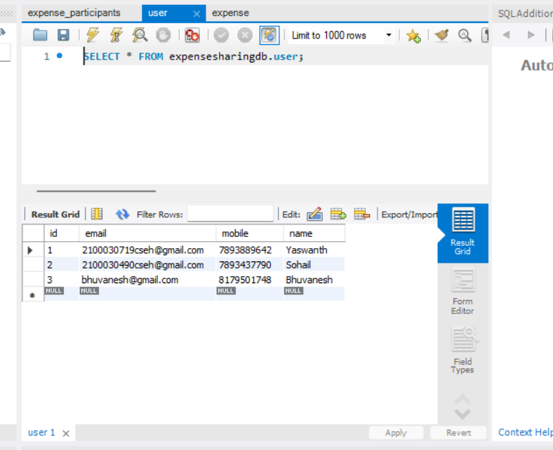
</p>

---

## 📌 Overview

Managing shared expenses across a group can quickly become complicated — especially when different people contribute different amounts or use different splitting rules.

The **Daily Expenses Sharing Platform** simplifies this process by providing a RESTful backend that allows users to:

* 👤 Create and manage user profiles
* 💳 Record individual and shared expenses
* ⚖️ Split expenses using multiple strategies
* 🧮 Automatically calculate participant contributions
* 📊 Generate consolidated balance sheets
* 🔎 Retrieve expenses by user or expense ID
* 🗄️ Persist application data using MySQL

The application follows a clean **layered backend architecture**, separating API controllers, business logic, persistence, domain entities, and utility functions.

---

# 🎯 Problem

Managing expenses manually becomes difficult when multiple people are involved.

For every shared expense, users need to keep track of:

* Who paid the expense
* Who participated
* How much each person owes
* Whether the expense should be split equally
* Exact amounts owed by each participant
* Percentage-based contributions
* Overall balances between participants

Manual calculations can easily introduce inconsistencies and errors.

### 💡 Goal

Build a backend system that allows users to **record expenses once and automatically calculate how the expense should be distributed among participants.**

---

# 💡 Solution

The platform models users, expenses, participants, and split strategies and applies dedicated business logic to calculate each participant's contribution.

```text
                         ┌─────────────────────────┐
                         │       REST Clients      │
                         │ Postman / Frontend / API│
                         └────────────┬────────────┘
                                      │
                                      ▼
                         ┌─────────────────────────┐
                         │      REST Controllers   │
                         │ UserController          │
                         │ ExpenseController       │
                         └────────────┬────────────┘
                                      │
                                      ▼
                         ┌─────────────────────────┐
                         │        Services         │
                         │ UserService             │
                         │ ExpenseService          │
                         └────────────┬────────────┘
                                      │
                     ┌────────────────┴────────────────┐
                     │                                 │
                     ▼                                 ▼
          ┌─────────────────────┐           ┌─────────────────────┐
          │   Split Engine      │           │ Spring Data JPA     │
          │                     │           │    Repositories     │
          │ • Equal             │           └──────────┬──────────┘
          │ • Exact             │                      │
          │ • Percentage        │                      ▼
          └─────────────────────┘           ┌─────────────────────┐
                                            │        MySQL        │
                                            │     expensesharingdb│
                                            └─────────────────────┘
```

---

# ✨ Key Features

## 👤 1. User Management

The platform provides APIs for creating and retrieving user profiles.

Each user contains information such as:

* Name
* Email
* Mobile number

### Available Operations

| Method | Endpoint      | Description                   |
| :----: | ------------- | ----------------------------- |
| `POST` | `/users`      | Create a new user             |
|  `GET` | `/users/{id}` | Retrieve a user by ID         |
|  `GET` | `/users`      | Retrieve all registered users |

---

# 💳 2. Expense Tracking

Users can create and retrieve shared expenses involving multiple participants.

An expense can contain:

* Expense amount
* Paying user
* Participants
* Split type
* Individual contribution

### Available Operations

| Method | Endpoint                  | Description                              |
| :----: | ------------------------- | ---------------------------------------- |
| `POST` | `/expenses`               | Create a new expense                     |
|  `GET` | `/expenses/{id}`          | Retrieve an expense by ID                |
|  `GET` | `/expenses`               | Retrieve all expenses                    |
|  `GET` | `/expenses/user/{userId}` | Retrieve expenses associated with a user |
|  `GET` | `/expenses/balance-sheet` | Generate the balance sheet               |

---

# ⚖️ 3. Flexible Expense Splitting

The core functionality of the platform is its **expense-splitting engine**.

It supports three different splitting strategies.

---

## 🟢 Equal Split

The expense is divided equally between all participants.

### Example

```text
Total Expense: ₹1,000
Participants:  4

User A → ₹250
User B → ₹250
User C → ₹250
User D → ₹250

Total → ₹1,000
```

---

## 🔵 Exact Split

Each participant can be assigned a specific amount.

### Example

```text
Total Expense: ₹1,000

User A → ₹400
User B → ₹300
User C → ₹200
User D → ₹100

Total → ₹1,000
```

---

## 🟣 Percentage Split

Each participant can be assigned a custom percentage of the total expense.

### Example

```text
Total Expense: ₹1,000

User A → 40% → ₹400
User B → 30% → ₹300
User C → 20% → ₹200
User D → 10% → ₹100

Total → ₹1,000
```

The splitting logic is isolated from the REST layer, allowing the calculation logic to evolve independently from the API implementation.

---

# 📊 4. Balance Sheet Generation

The platform provides a consolidated balance-sheet endpoint that summarizes the financial position of users.

It helps answer:

```text
Who spent money?
Who participated?
How much did each person contribute?
How much does each participant owe?
```

The balance sheet transforms individual expense records into a consolidated financial view.

---

# 🏗️ Project Architecture

The application follows a layered Spring Boot architecture.

```text
src/main/java/com/expensesharing/

├── controllers/
│   ├── UserController.java
│   └── ExpenseController.java
│
├── services/
│   ├── UserService.java
│   └── ExpenseService.java
│
├── repositories/
│   └── Spring Data JPA repositories
│
├── entities/
│   ├── User.java
│   ├── Expense.java
│   ├── Participant.java
│   └── SplitType.java
│
└── utilities/
    └── ExpenseSplitUtil.java
```

### Layer Responsibilities

| Layer            | Responsibility                          |
| ---------------- | --------------------------------------- |
| **Controllers**  | Handle HTTP requests and REST endpoints |
| **Services**     | Implement core business logic           |
| **Repositories** | Handle database persistence             |
| **Entities**     | Represent application/domain models     |
| **Utilities**    | Implement reusable expense calculations |

---

# 🛠️ Technology Stack

| Technology               | Purpose                         |
| ------------------------ | ------------------------------- |
| ☕ **Java 17+**           | Backend application development |
| 🌱 **Spring Boot 3.3.2** | REST API framework              |
| 🗃️ **Spring Data JPA**  | Database persistence            |
| 🔄 **Hibernate**         | ORM and entity management       |
| 🐬 **MySQL 8.0+**        | Relational database             |
| ✅ **Jakarta Validation** | Request/data validation         |
| 🧩 **Lombok**            | Boilerplate code reduction      |
| 📦 **Maven**             | Build and dependency management |

---

# 🗄️ Database Configuration

The application uses **MySQL** for persistent data storage.

Create the database:

```sql
CREATE DATABASE expensesharingdb;
```

Configure your database credentials inside:

```text
src/main/resources/application.properties
```

Example configuration:

```properties
# MySQL Database Connection
spring.datasource.url=jdbc:mysql://localhost:3306/expensesharingdb
spring.datasource.username=YOUR_MYSQL_USERNAME
spring.datasource.password=YOUR_MYSQL_PASSWORD
spring.datasource.driverClassName=com.mysql.cj.jdbc.Driver

# JPA & Hibernate
spring.jpa.database-platform=org.hibernate.dialect.MySQL8Dialect
spring.jpa.hibernate.ddl-auto=update
spring.jpa.show-sql=true
spring.jpa.properties.hibernate.format_sql=true
```

> ⚠️ **Security:** Never commit real database credentials to GitHub. Use environment variables or a local configuration file for production deployments.

---

# 🚀 Getting Started

## Prerequisites

Make sure you have the following installed:

* **JDK 17 or higher**
* **Maven 3.6+**
* **MySQL 8.0+**
* **Git**

---

## 1️⃣ Clone the Repository

```bash
git clone https://github.com/kartheekkarumanchi99/Daily_Expenses_Sharing_Platform.git

cd Daily_Expenses_Sharing_Platform
```

---

## 2️⃣ Create the Database

Start your local MySQL server and execute:

```sql
CREATE DATABASE expensesharingdb;
```

---

## 3️⃣ Configure Database Credentials

Open:

```text
src/main/resources/application.properties
```

Update:

```properties
spring.datasource.username=YOUR_MYSQL_USERNAME
spring.datasource.password=YOUR_MYSQL_PASSWORD
```

---

## 4️⃣ Build and Run

Using the Maven wrapper:

```bash
./mvnw spring-boot:run
```

Or run the main Spring Boot application class from:

* IntelliJ IDEA
* Eclipse
* VS Code

---

## 5️⃣ Verify the Application

Once the application starts successfully:

```text
http://localhost:8080
```

The REST APIs can then be accessed using tools such as **Postman**, cURL, or a frontend client.

---

# 📡 API Reference

## 👤 User APIs

### Create User

```http
POST /users
```

Example request:

```json
{
  "name": "user1",
  "email": "test1@gmail.com",
  "mobile": "1234567890"
}
```

---

### Get User

```http
GET /users/{id}
```

---

### Get All Users

```http
GET /users
```

---

# 💵 Expense APIs

### Create Expense

```http
POST /expenses
```

---

### Get Expense

```http
GET /expenses/{id}
```

---

### Get All Expenses

```http
GET /expenses
```

---

### Get User Expenses

```http
GET /expenses/user/{userId}
```

---

### Generate Balance Sheet

```http
GET /expenses/balance-sheet
```

---

# 📸 Proof of Work

> The following snapshots demonstrate the implemented application workflows, REST API operations, expense-splitting logic, database interactions, and generated results.

<div align="center">

<table>
<tr>

<td align="center">

<br/>
<b>01 — User Management</b>
</td>

<td align="center">
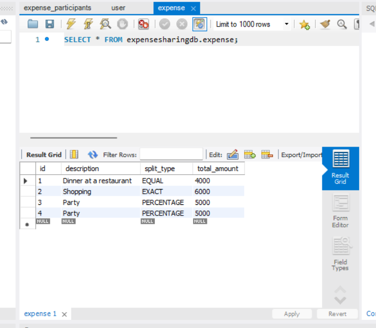
<br/>
<b>02 — User Creation</b>
</td>

<td align="center">
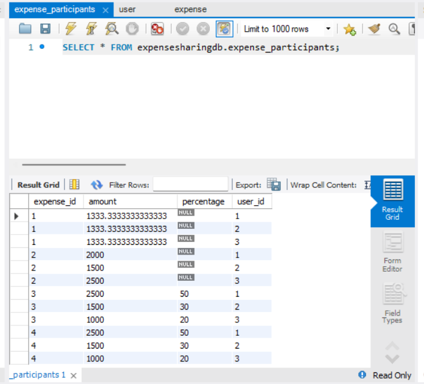
<br/>
<b>03 — Expense Creation</b>
</td>

</tr>

<tr>

<td align="center">
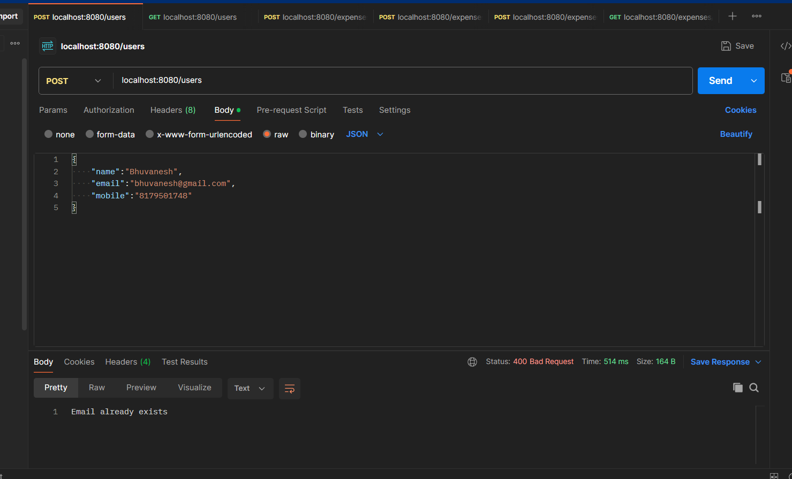
<br/>
<b>04 — Equal Split</b>
</td>

<td align="center">
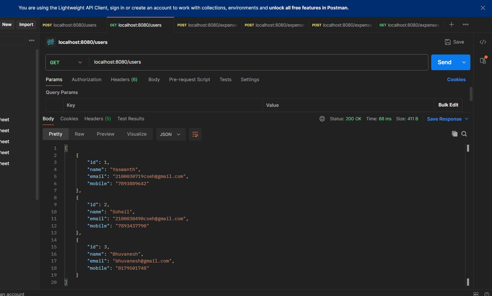
<br/>
<b>05 — Exact Split</b>
</td>

<td align="center">
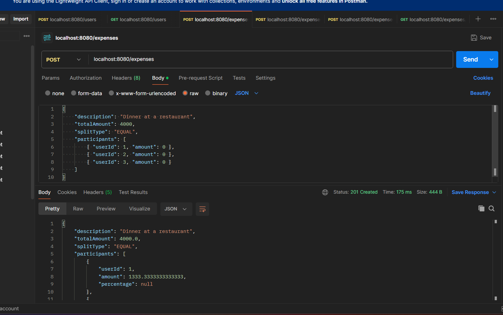
<br/>
<b>06 — Percentage Split</b>
</td>

</tr>

<tr>

<td align="center">
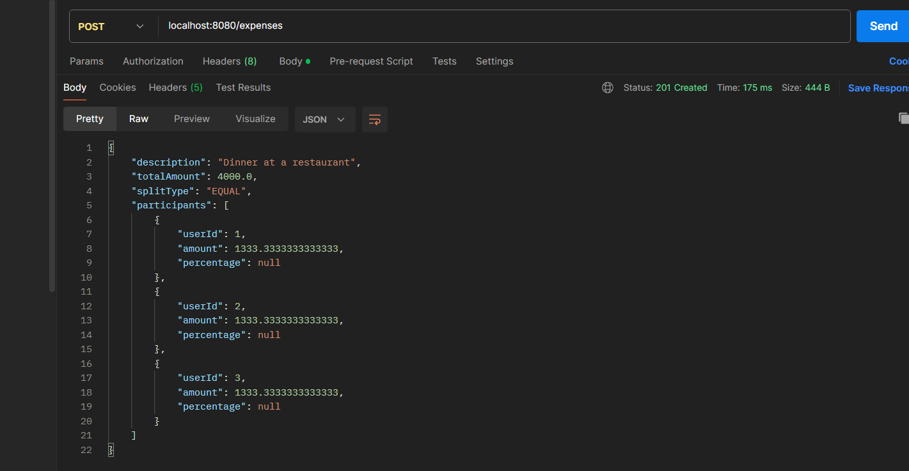
<br/>
<b>07 — Expense Retrieval</b>
</td>

<td align="center">
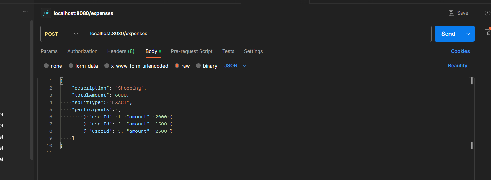
<br/>
<b>08 — User Expenses</b>
</td>

<td align="center">
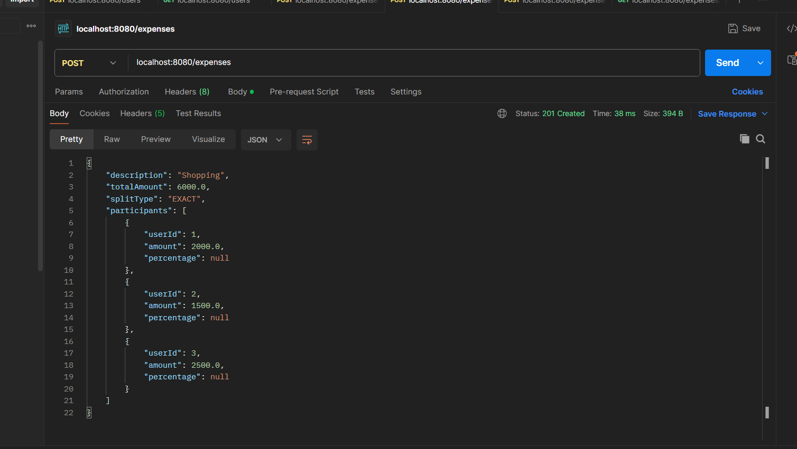
<br/>
<b>09 — Balance Sheet</b>
</td>

</tr>

<tr>

<td align="center">
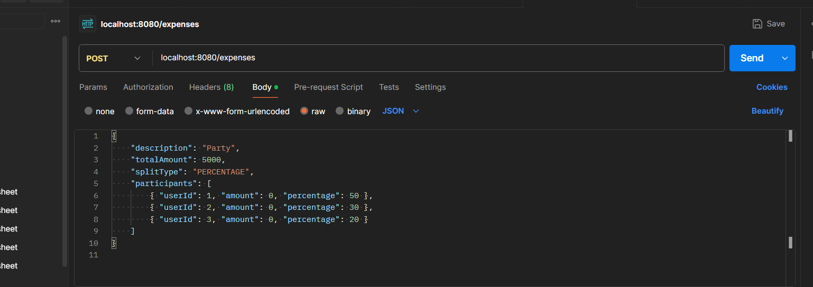
<br/>
<b>10 — Database State</b>
</td>

<td align="center">
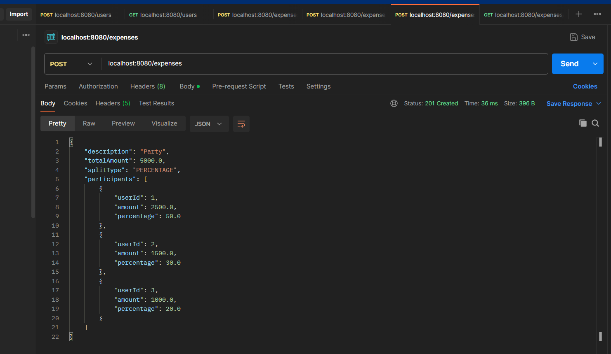
<br/>
<b>11 — API Workflow</b>
</td>

<td align="center">
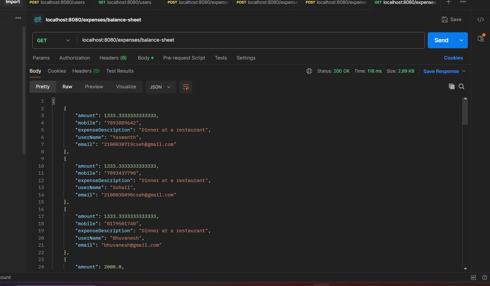
<br/>
<b>12 — End-to-End Implementation</b>
</td>

</tr>
</table>

</div>

---

# 🔍 Engineering Highlights

### 🧱 Layered Architecture

The application separates controllers, services, repositories, entities, and utility logic to maintain a clean separation of concerns.

### ⚖️ Extensible Split Engine

Expense calculation logic is isolated from the REST API layer, making it easier to introduce additional splitting strategies in the future.

### 🗄️ Relational Persistence

Application data is persisted using **Spring Data JPA + Hibernate + MySQL**.

### 🔄 RESTful API Design

The backend exposes resource-oriented endpoints for users and expenses using standard HTTP methods.

### 🧮 Automated Calculations

The system automatically calculates participant contributions based on the selected split strategy.

### 📊 Consolidated Financial View

The balance-sheet functionality aggregates expense information into a unified representation of user balances.

---

# 🧪 Example Workflow

A typical expense-sharing workflow looks like this:

```text
        1. Create Users
               │
               ▼
        2. Create Expense
               │
               ▼
        3. Add Participants
               │
               ▼
        4. Select Split Type
               │
       ┌───────┼────────┐
       ▼       ▼        ▼
     Equal   Exact   Percentage
       │       │        │
       └───────┼────────┘
               ▼
        5. Calculate Shares
               │
               ▼
        6. Persist Expense
               │
               ▼
        7. Generate Balance Sheet
```

---

# 📈 Future Improvements

The current architecture can be extended with:

* 🔐 Authentication and authorization
* 👥 Group-based expense management
* 💰 Debt simplification algorithms
* 📱 Web/mobile frontend
* 📧 Expense notifications
* 📊 Expense analytics and dashboards
* 🧪 Automated unit and integration testing
* 📖 Swagger / OpenAPI documentation
* 🐳 Docker containerization
* ☁️ Cloud deployment
* ⚡ Caching and performance optimization

---

# 📂 Repository Structure

```text
Daily_Expenses_Sharing_Platform/
│
├── src/
│   ├── main/
│   │   ├── java/
│   │   │   └── com/expensesharing/
│   │   │       ├── controllers/
│   │   │       ├── services/
│   │   │       ├── repositories/
│   │   │       ├── entities/
│   │   │       └── utilities/
│   │   │
│   │   └── resources/
│   │       └── application.properties
│
├── img_1.png
├── img_2.png
├── img_3.png
├── img_4.png
├── img_5.png
├── img_6.png
├── img_7.png
├── img_8.png
├── img_9.png
├── img_10.png
├── img_11.png
├── img_12.png
│
├── pom.xml
├── mvnw
├── mvnw.cmd
└── README.md
```

---

# 📸 Project Demonstration

The repository includes **12 implementation snapshots** covering the major functionality of the platform.

These snapshots provide visual evidence of:

**User Management → Expense Creation → Split Calculation → Expense Retrieval → Balance Sheet → Database Persistence → End-to-End Workflow**

---

# 👨‍💻 Author

## Kartheek Karumanchi

**Software Engineer | Backend & AI Systems**

📧 **Email:** [kartheekkarumanchi99@gmail.com](mailto:kartheekkarumanchi99@gmail.com)

🐙 **GitHub:** [@kartheekkarumanchi99](https://github.com/kartheekkarumanchi99)

---

<div align="center">

### ⭐ If you found this project useful, consider giving the repository a star!

**Built with ☕ Java + 🌱 Spring Boot + 🐬 MySQL**

</div>
